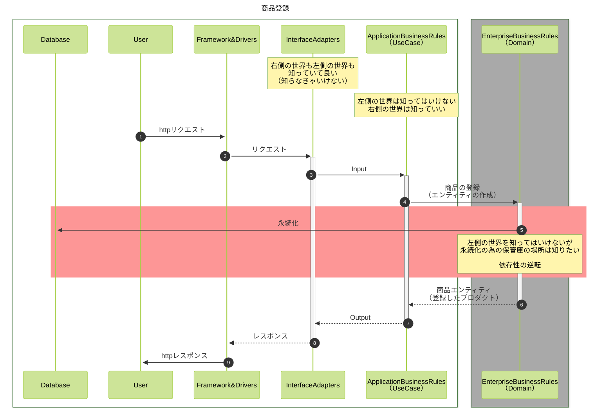

```bash
npm install -g pnpm
pnpm add typescript
pnpm add @types/node
pnpm tsc --init --rootDir src --outDir lib --esModuleInterop --resolveJsonModule --lib es6,dom  --module commonjs
pnpm add ts-node
pnpm add tsyringe
pnpm add reflect-metadata
pnpm add drizzle-orm better-sqlite3
pnpm add -D @types/better-sqlite3
pnpm add -D drizzle-kit
pnpm run start
```


# DIとは？

依存性の注入（`Dependency Injection`）、 依存性の逆転（`Dependency Inversion`）の事  
それだけだと価値が薄いので必ずセットとなる概念として`DI Container`   


### 依存性の注入
```typescript
const salesRecord = [
    {'name': 'セキュアな設計', 'price': 4000, 'genre': 'book'},
    {'name': 'StrawberryPi', 'price': 20000, 'genre': 'pc'},
    {'name': 'yPad', 'price': 100000, 'genre':'phone'},
    {'name': 'yPhone', 'price': 150000, 'genre':'phone'},
    {'name': 'oroid', 'price': 30000, 'genre': 'phone'},
    {'name': 'yPhone', 'price': 150000, 'genre': 'phone'},
    {'name': 'yPhone', 'price': 150000, 'genre': 'phone'},
];
Object.freeze(salesRecord);
console.log(salesRecord)

//DIじゃないフィルター関数
const filterByGenre = (rawData, genrename) => {
    //return rawData.filter(v => v.genre === genrename)
    let result = [];
    for(const v of rawData) {
        if (v.genre === genrename) {
            result.push(v);
        }
    }
    return result;
};
console.log(filterByGenre(salesRecord,  'phone'));
/*
[
  { name: "yPad", price: 100000, genre: "phone" },
  { name: "yPhone", price: 150000, genre: "phone" },
  { name: "oroid", price: 30000, genre: "phone" },
  { name: "yPhone", price: 150000, genre: "phone" },
  {
]
*/

const filterByUpperPrice = (rawData, price) => {
    //return rawData.filter(v => v.price <= upperLimit)
    let result = [];
    for(const v of rawData) {
        if (v.price <= price) {
            result.push(v);
        }
    }
    return result;
};
console.log(filterByUpperPrice(salesRecord,  100000));
/*
[
  { name: "セキュアな設計", price: 4000, genre: "book" },
  { name: "StrawberryPi", price: 20000, genre: "pc" },
  { name: "yPad", price: 100000, genre: "phone" },
  { name: "oroid", price: 30000, genre: "phone" }
]
*/


//DIなフィルター
const filter = (rawData, condition) => {
    let result = [];
    for(const v of rawData) {
        if (condition(v)) {
            result.push(v);
        }
    }
    return result;
};

const conditionGenre = src => src.genre === 'phone';
const conditionPrice = src => src.price <= 100000;
console.log(filter(salesRecord, conditionGenre));
console.log(filter(salesRecord, conditionPrice));

// さらに疎結合を極めた形にすると下記のように処理のシーケンスを書だけで済ませる事も可能
const condG = conditionG('phone');
const filteredData1 = filter(rawData, condG);

const condP = conditionPriceUpper(10000);
const filteredData2 = filter(rawData, condP);
```

### 依存性の逆転

